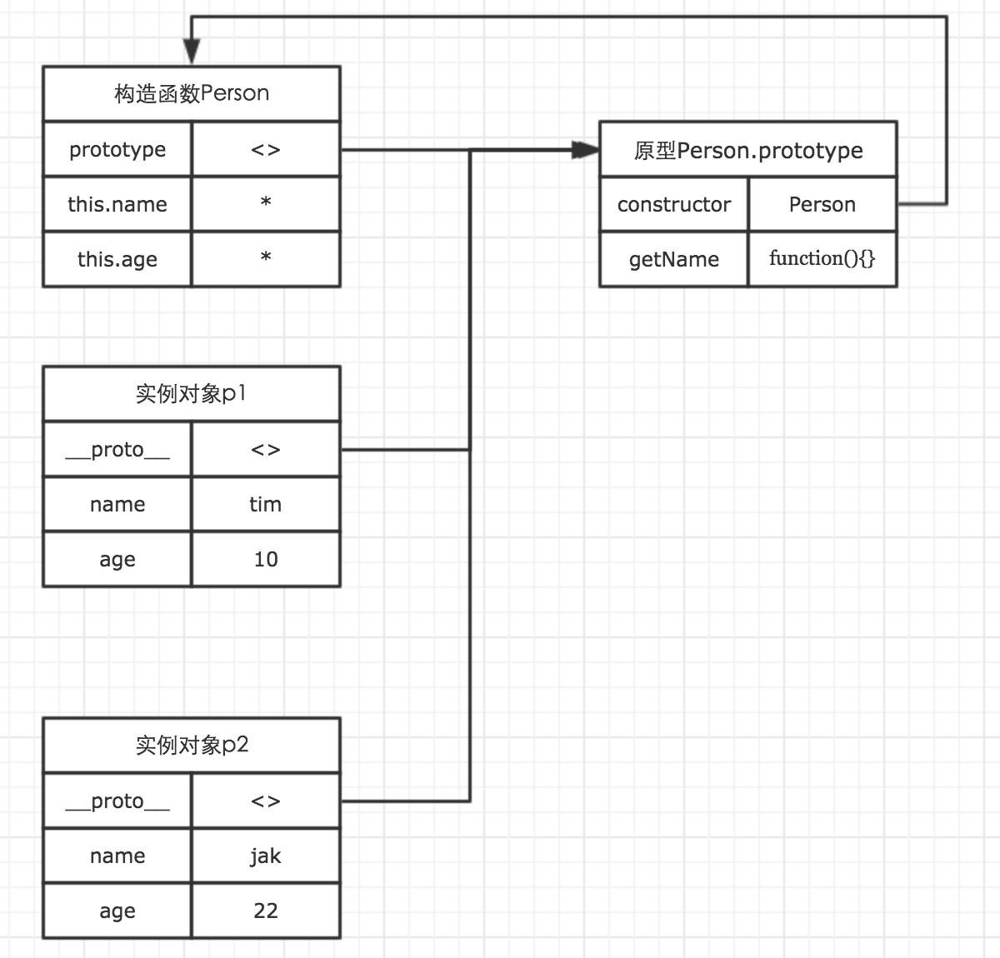

# web前端开发面试知识点整理

## JavaScript

### 原型

> 我们创建的每一个函数，都可以有一个 prototype 属性，该属性指向一个对象。这个对象，就是原型。

当我们在创建对象时，可以根据自己的需求，选择性的将一些属性和方法通过 prototype 属性，挂载在原型对象上。而每一个 new 出来的实例，都有一个 proto 属性，该属性指向构造函数的原型对象，通过这个属性，让实例对象也能够访问原型对象上的方法。因此，当所有的实例都能够通过 proto 访问到原型对象时，原型对象的方法与属性就变成了共有方法与属性。

```js
// 声明构造函数
function Person(name, age) {
  this.name = name;
  this.age = age;
}
 
// 通过prototye属性，将方法挂载到原型对象上
Person.prototype.getName = function() {
  return this.name;
}
 
var p1 = new Person('tim', 10);
var p2 = new Person('jak', 22);
console.log(p1.getName === p2.getName); // true
```



通过图示我们可以看出，构造函数的 prototype 与所有实例对象的 proto 都指向原型对象。而原型对象的 constructor 指向构造函数。

### 原型链

> 基本思想是利用原型让一个引用类型继承另一个引用类型的属性和方法（红宝书）

我们知道所有的函数都有一个叫做 toString 的方法。那么这个方法到底是在哪里的呢？

先随意声明一个函数：

```js	
function foo() {}
```


其中 foo 是 Function 对象的实例。而 Function 的原型对象同时又是 Object 的实例。这样就构成了一条原型链。原型链的访问，其实跟作用域链有很大的相似之处，他们都是一次单向的查找过程。因此实例对象能够通过原型链，访问到处于原型链上对象的所有属性与方法。这也是 foo 最终能够访问到处于 Object 原型对象上的 toString 方法的原因。

### 作用域链

作用域链的作用是保证执行环境里有权访问的变量和函数是有序的，作用域链的变量只能向上访问，变量访问到 window 对象即被终止，作用域链向下访问变量是不被允许的。

### 闭包

> * 第一种理解（红宝书）：是指有权访问另一个函数作用域中的变量的函数，创建闭包的最常见的方式就是在一个函数内创建另一个函数，通过另一个函数访问这个函数的局部变量
> * 第二种理解（你不知道的 javascript）：当函数可以记住并访问所在的词法作用域时，就产生了闭包，这个函数持有对该词法作用域的引用，这个引用就叫做闭包
> * 闭包本质还是函数，只不过这个函数绑定了上下文环境（函数内部引用的所有变量）

**缺点：** 常驻内存，会增大内存使用量，使用不当很容易造成内存泄露。

**作用（使用场景）：** 可以用来管理私有变量和私有方法，将对变量（状态）的变化封装在安全的环境中，使得这些变量不能被外部随意修改，同时又可以通过指定的函数接口来操作。

**闭包有三个特性：** 

1. 函数嵌套函数
2. 函数内部可以应用外部的参数和变量
3. 参数和变量不会被垃圾回收机制回收

题外话：

> * Javascript 的作用域是词法作用域而不是动态作用域
> * 词法作用域最重要的特征是它的定义过程发生在代码的书写阶段
> * 动态作用域的作用域链是基于调用栈的 词法作用域的作用域链是基于代码中的作用域嵌套

### this 相关

**this 的指向：**

1. 作为普通函数调用（this 指向全局对象 window 对象）
2. 作为对象的方法调用（this 指向该对象）
3. 构造器调用（this 指向用 new 返回的这个对象）
4. call、apply、bind 的调用（this 指向第一个参数对象）

### 高阶函数

1. 函数作为参考数值
2. 函数作为返回值输出

### new 操作符具体干了些什么呢？

1. 创建一个新对象
2. 将构造函数的作用域赋给新对象（因此 this 就指向了这个新对象）
3. 执行构造函数中的代码（为这个新对象添加属性）
4. 返回新对象

### 继承

1. 简单原型链继承

```js
function Super(){
  this.name = 'hzzly';
}
function Sub(){
  // ...
}
Sub.prototype = new Super();    // 核心
```

缺点：

修改 sub1.name 后 sub2.name 也变了，因为来自原型对象的引用属性是所有实例共享的。

2. 构造函数式继承

```js
function Super(val){
  this.val = val;
  his.fun = function(){  // 实例函数
  	// ...
  }
}
function Sub(val){
  Super.call(this, val);   // 核心
  // ...
}
```

缺点：

无法实现函数复用，每个子类实例都持有一个新的 fun 函数，太多了就会影响性能，内存爆炸。

3. 组合式继承

```js
function Super(){
  this.name = 'hzzly';
}
// 原型函数
Super.prototype.fun1 = function(){};
Super.prototype.fun2 = function(){};
//Super.prototype.fun3...
function Sub(){
  Super.call(this);   // 核心
  // ...
}
Sub.prototype = new Super();    // 核心
```

缺点： 

子类原型上有一份多余的父类实例属性，因为父类构造函数被调用了两次，生成了两份，而子类实例上的那一份屏蔽了子类原型上父类的。又是内存浪费。

4. 寄生组合式继承

```js
function Super(){
  this.name = 'hzzly';
}
Super.prototype.fun1 = function(){};
Super.prototype.fun2 = function(){};
//Super.prototype.fun3...
function Sub(){
  Super.call(this);   // 核心
  // ...
}
Sub.prototype=Object.create(Super.prototype)   // 核心
Sub.prototype.constructor=Sub   // 核心
```

5. es6 的 class 继承方式

```js
class A {}
class B extends A {}
B.__proto__ === A   // true
B.prototype.__proto__ === A.prototype   // true
```

es6 引入了 class、extends、super、static(部分为 ES2016 标准)

### null 和 undefined 的区别

1. null 是一个表示” 无” 的对象，转为数值时为 0；undefined 是一个表示” 无” 的原始值，转为数值时为 NaN。
2. undefined 表示” 缺少值”，就是此处应该有一个值，但是还没有定义。
3. null 表示” 没有对象”，即该处不应该有值。

### call、apply、bind 的区别

* 三者都是用来改变函数的 this 对象的指向的。
* 三者第一个参数都是 this 要指向的对象，也就是指定的上下文。
* call 传入的参数数量不固定，第二部分参数要一个一个传， 用 `,` 隔开。
* apply 接受 2 个参数，第二个参数为一个带下标的集合，可以为数组，也可以为类数组。
* bind 是返回一个改变了上下文的函数副本，便于稍后调用；apply、call 则是立即调用。

### 简述面向对象的三大特性

> 封装：每个对象都包括自己进行操作所需要的所有信息，而不依赖于其他对象来完成自己的操作。这样的方法和属性通过类的实例来实现。

> 继承：继承是指这样一种能力：它可以使用现有类的所有功能，并在无需重新编写原来的类的情况下对这些功能进行扩展。

> 多态：所谓多态就是指一个类实例的相同方法在不同情形有不同表现形式。多态机制使具有不同内部结构的对象可以共享相同的外部接口。

## 网络协议、浏览器机制、性能优化

### 本地存储

> * sessionStorage 用于本地存储一个会话（session）中的数据，这些数据只有在同一个会话中的页面才能访问并且当会话结束后数据也随之销毁。因此 sessionStorage 不是一种持久化的本地存储，仅仅是会话级别的存储。
> * localStorage 用于持久化的本地存储，除非主动删除数据，否则数据是永远不会过期的。

### cookie 和 session

1. cookie 数据存放在客户的浏览器上，session 数据放在服务器上。
2. cookie 不是很安全，别人可以分析存放在本地的 cookie 并进行 cookie 欺骗，考虑到安全应当使用 session。
3. session 会在一定时间内保存在服务器上。当访问增多，会比较占用你服务器的性能，考虑到减轻服务器性能方面，应当使用 cookie。
4. 单个 cookie 保存的数据不能超过 4k，很多浏览器都限制一个站点最多保存 20 个 cookie。每次请求一个新的页面的时候 cookie 都会被发送过去，与服务器进行交互。

### XML 和 JSON 的区别？

* 数据体积方面。
  - JSON 相比于 XML 来讲，数据的体积小，传递的速度更快些。
* 数据交互方面。
  - JSON 与 JavaScript 的交互效果更加方便，更好的数据交互。
* 数据描述方面。
  - JSON 对数据的描述比 XML 较差。
* 传输速度方面。
  - JSON 的速度要远快于 XML。

### 如何实现浏览器内多个标签页之间的通信？

调用 localstorage、cookie 等本地存储方式

### 线程和进程的区别？

1. 一个程序至少有一个进程，一个进程至少有一个线程。
2. 线程的划分尺度小于进程，使得多线程程序的并发性高。
3. 进程在执行过程中拥有独立的内存单元，而多个线程共享内存，从而极大地提高了程序的运行效率。
4. 线程在执行过程中与进程还是有区别的，每个独立的线程有一个程序运行的入口、顺序执行序列和程序的出口。但是线程不能够独立运行，必须依存在应用程序中，由应用程序提供多个线程进行控制。
5. 从逻辑角度来看，多线程的意义在于一个应用程序中，有多个执行部分可以同时执行。但是操作系统并没有将多个线程看作多个独立的应用，来实现进程的调度管理以及资源分配。这就是进程和线程的重要区别。

### 渐进增强和优雅降级

* 渐进增强：针对低版本浏览器进行构建页面，保证最基本的功能没然后在针对高级浏览器进行效果、交互等改进和追加功能达到更好的用户体验。
* 优雅降级： 一开始就构建完整的功能，然后在对低版本浏览器进行兼容。

### 性能优化

* 网页内容
  - 减少 http 请求次数
  - 减少 DNS 查询次数
  - 避免页面跳转
  - 缓存 Ajax 
  - 延迟加载
  - 提前加载
  - 减少 DOM 元素数量
  - 避免 404
* 服务器
  - 使 CDN（内容分发网络）
  - 添加 Expires 和 Cache-Control 报文头
  - Gzip 压缩传输文件
* CSS
  - 将样式表置项
  - 避免使用 @import
* JavaScript
  - 把脚本置于页面底部
  - 使用外部 JavaScript 和 CSS
  - 精简 JavaScript 和 CSS
  - 去除重复脚本
  - 减少 DOM 访问
* 图片
  - 优化图像
  - 优化 CSS Spirite
  - 不要在 HTML 中缩放图片
  - favicon.ico 要小且可缓存

### 如何解决跨域问题？

> jsonp、CORS、document.domain+iframe、window.name、window.postMessage

jsonp 的原理是动态插入 script 标签

### 请解释一下 JavaScript 的同源策略。

> 同源策略指的是：协议，域名，端口相同，同源策略是一种安全协议。

指一段脚本只能读取来自同一来源的窗口和文档的属性。

### 哪些操作会造成内存泄漏？

1. 内存泄漏指任何对象在您不再拥有或需要它之后仍然存在。
2. 垃圾回收器定期扫描对象，并计算引用了每个对象的其他对象的数量。如果一个对象的引用数量为 0（没有其他对象引用过该对象），或对该对象的惟一引用是循环的，那么该对象的内存即可回收。
3. setTimeout 的第一个参数使用字符串而非函数的话，会引发内存泄漏。闭包、控制台日志、循环（在两个对象彼此引用且彼此保留时，就会产生一个循环）

### JavaScript 垃圾回收机制

1. 标记清除：这是 JavaScript 最常见的垃圾回收方式，当变量进入执行环境的时候，比如函数中声明一个变量，垃圾回收器将其标记为 “进入环境”，当变量离开环境的时候（函数执行结束）将其标记为 “离开环境”。
2. 引用计数：引用计数的策略是跟踪记录每个值被使用的次数，当声明了一个 变量并将一个引用类型赋值给该变量的时候这个值的引用次数就加 1，如果该变量的值变成了另外一个，则这个值得引用次数减 1，当这个值的引用次数变为 0 的时 候，说明没有变量在使用，这个值没法被访问了，因此可以将其占用的空间回收，这样垃圾回收器会在运行的时候清理掉引用次数为 0 的值占用的空间。

### 事件、IE 与火狐的事件机制有什么区别？ 如何阻止冒泡？

事件处理机制：IE 是事件冒泡、firefox 同时支持两种事件模型，也就是：捕获型事件和冒泡型事件。

阻止冒泡：`ev.stopPropagation()`

### 严格模式的限制和设立严格模式的目的

> 严格模式是 JavaScript 中的一种限制性更强的变种方式。严格模式会将 JavaScript 陷阱直接变成明显的错误。同样的代码有些时候严格模式会比非严格模式下更快。禁用了一些有可能在未来版本中定义的语法。

要给某个函数开启严格模式，得把 "use strict" 声明一字不漏地放在函数体所有语句之前。

* 限制： 
  - 变量必须声明后再使用
  - 函数的参数不能有同名属性，否则报错
  - 禁止 this 指向全局对象
  - 不能使用 with 语句
  - 增加了保留字
  - arguments 不会自动反映函数参数的变化

* 目的：
  - 消除 Javascript 语法的一些不合理、不严谨之处，减少一些怪异行为；消除代码运行的一些不安全之处，保证代码运行的安全；提高编译器效率，增加运行速度；为未来新版本的 Javascript 做好铺垫。

### 请解释什么是事件代理

事件代理（Event Delegation），又称之为事件委托。即是把原本需要绑定的事件委托给父元素，让父元素担当事件监听的职务。事件代理的原理是 DOM 元素的事件冒泡。使用事件代理的好处是可以提高性能。

### Event Loop、消息队列、事件轮询

异步函数在执行结束后，会在事件队列中添加一个事件（回调函数）(遵循先进先出原则)，主线程中的代码执行完毕后（即一次循环结束），下一次循环开始就在事件队列中 “读取” 事件，然后调用它所对应的回调函数。这个过程是循环不断的，所以整个的这种运行机制又称为 Event Loop（事件循环）

主线程运行的时候，产生堆（heap）和栈（stack），栈中的代码（同步任务）调用各种外部 API，它们在” 任务队列” 中加入各种事件（click，load，done）。只要栈中的代码执行完毕，主线程就会去读取” 任务队列”，依次执行那些事件所对应的回调函数。

执行栈中的代码（同步任务），总是在读取” 任务队列”（异步任务）之前执行。

### 缓存

> 浏览器缓存（Browser Caching）是浏览器端保存数据用于快速读取或避免重复资源请求的优化机制，有效的缓存使用可以避免重复的网络请求和浏览器快速地读取本地数据，

* http 缓存

  > http 缓存是基于 HTTP 协议的浏览器文件级缓存机制。即针对文件的重复请求情况下，浏览器可以根据协议头判断从服务器端请求文件还是从本地读取文件

  > 判断 expires，如果未过期，直接读取 http 缓存文件

* index DB 

  > 是一个在客户端存储可观数量的结构化数据, 并且为这些数据添加索引进行高性能检索。

* cookie

  > 指一般网站为了辨别用户身份、储存在用户本地终端上的数据（通常经过加密）。cookie 一般通过 http 请求中在头部一起发送到服务器端。一条 cookie 记录主要由键、值、域、过期时间、大小组成，一般用户保存用户的认证信息。

* localstorage 

  > localStorage 是 h5 的一种新的本地缓存方案, 加快下次页面打开时的渲染速度, 除非主动删除数据，否则数据是永远不会过期的。

* sessionstorage

  > 也是 h5 的一种本地缓存方案，数据的存储仅特定于某个会话中，也就是说数据只保持到浏览器关闭，当浏览器关闭后重新打开这个页面时， 之前的存储已经被清除。

## 关于 ES6

### ES6 的了解

es6 是一个新的标准，它包含了许多新的语言特性和库，是 JS 最实质性的一次升级。比如’箭头函数’、’字符串模板’、’generators(生成器)’、’async/await’、’解构赋值’、’class’等等，还有就是引入 module 模块的概念。

`箭头函数` 可以让 this 指向固定化，这种特性很有利于封装回调函数

1. 函数体内的 this 对象，就是定义时所在的对象，而不是使用时所在的对象。
2. 不可以当作构造函数，也就是说，不可以使用 new 命令，否则会抛出一个错误。
3. 不可以使用 arguments 对象，该对象在函数体内不存在。如果要用，可以用 Rest 参数代替。
4. 不可以使用 yield 命令，因此箭头函数不能用作 Generator 函数。

`async/await` 是写异步代码的新方式，以前的方法有回调函数和 Promise。

1. async/await 是基于 Promise 实现的，它不能用于普通的回调函数。
2. async/await 与 Promise 一样，是非阻塞的。
3. async/await 使得异步代码看起来像同步代码，这正是它的魔力所在。

### 请列出尽量多的es6的新语法。

* 反引号
```js
  var str = `abc ${expr + `abc`}`
  fn`abcdef${x}${y}`
```
* 箭头函数
```js
  var fn = () => {}
  var fn = _ => 2
  var that = this
  var fn = _ => (this === that) 
```
* 解构赋值
```js
  var a = 1
  var b = 2

  var [c, d] = [a, b]
  var {a, b} = {
  a: 1,
  b: 2,
  c: 3
  }
```
* 形参解构
```js
  function a({x, y}){
  console.log(x * y)
  }
  a({
  x:1,
  y:8,
  })

  function b([x, y]){

  }

  b([1, 2, 3, 4, 5])
```
* 计算属性
```js
  var obj = {
    a: 8,
  }
  obj[x*y] = 9
  var obj = {
    [expr]: 3,
    expr: 5,
    get [a]() {

    },
    set [](value) {

    },
  }
```
* restpara 剩余参数
```js
  function(a, b, c, ...args){

  }
```
* spread operator 数组展开
```js
  Math.max(...[1,2,3,4,5,6,7,8,9]) === Math.max(1,2,3,4,5,6,7,8,9)
```
* let 

  用let声明的变量不提升，TDZ， temaper Dead Zone
```js
  {
    var a = 8
    ...
    ...
    ...
    let b =9
    console.log(a * b)
  }
```
* 默认参数
```js
  function f(x = 8, y = 9, z = function(){})  
```
* const

  阻止被const声明变量指向其他的值
```js
  const a = expr
  a = xxx //报错
```
* class
```js
  class A {
    //静态方法
    //挂在A上
    //即A.f
    static f(){
      return 8
    }
    //构造函数体
    //即function A(){}
    constructor() {
      this.x = 9
      this.fn = function(){}
    }
    //实例方法
    //即A.prototype.methodA
    methodA(){

    }
  }
```
* forof
* 对象方法简写/对象属性简写
* Map/Set
* Symbol
* Proxy
* gennerator

### 说说你对 Promise 的理解

> Promise 是异步编程的一种解决方案，比传统的解决方案——回调函数和事件监听——更合理和更强大。

所谓 Promise，简单说就是一个容器，里面保存着某个未来才会结束的事件（通常是一个异步操作）的结果。从语法上说，Promise 是一个对象，从它可以获取异步操作的消息。Promise 提供统一的 API，各种异步操作都可以用同样的方法进行处理。

Promise 对象有以下两个特点:

> * 对象的状态不受外界影响，Promise 对象代表一个异步操作，有三种状态：Pending（进行中）、Resolved（已完成，又称 Fulfilled）和 Rejected（已失败）
> * 一旦状态改变，就不会再变，任何时候都可以得到这个结果。

### 说说你对 AMD 和 Commonjs 的理解

CommonJS 是服务器端模块的规范，Node.js 采用了这个规范。CommonJS 规范加载模块是同步的，也就是说，只有加载完成，才能执行后面的操作。AMD 规范则是非同步加载模块，允许指定回调函数。

AMD 推荐的风格通过返回一个对象做为模块对象，CommonJS 的风格通过对 module.exports 或 exports 的属性赋值来达到暴露模块对象的目的。

### Gulp、Webpack 比较

* Gulp
  - Gulp 就是为了规范前端开发流程，实现前后端分离、模块化开发、版本控制、文件合并与压缩、mock 数据等功能的一个前端自动化构建工具。
  - Gulp 就像是一个产品的流水线，整个产品从无到有，都要受流水线的控制，在流水线上我们可以对产品进行管理。
  - Gulp 是通过 task 对整个开发过程进行构建。

* Webpack
  - 当下最热门的前端资源模块化管理和打包工具
  - 可以很好的管理模块以及各个模块之间的依赖
  - 对 js、css、图片等资源文件都支持打包
  - 有独立的配置文件 webpack.config.js
  - 可以将代码切割成不同的 chunk，实现按需加载，降低了初始化时间
  - 可以生成优化且合并后的静态资源

* Webpack两大特色：
  1. 代码可以自动完成编译。
  2. loader 可以处理各种类型的静态文件，并且支持串联操作

## CSS

### display:none 和 visibility:hidden 的区别？

display:none 隐藏对应的元素，在文档布局中不再给它分配空间，它各边的元素会合拢，就当他从来不存在。

visibility:hidden 隐藏对应的元素，但是在文档布局中仍保留原来的空间。

### position:absolute 和 float 属性的异同

* 共同点：对内联元素设置float和absolute属性，可以让元素脱离文档流，并且可以设置其宽高。
* 不同点：float 仍会占据位置，position 会覆盖文档流中的其他元素。